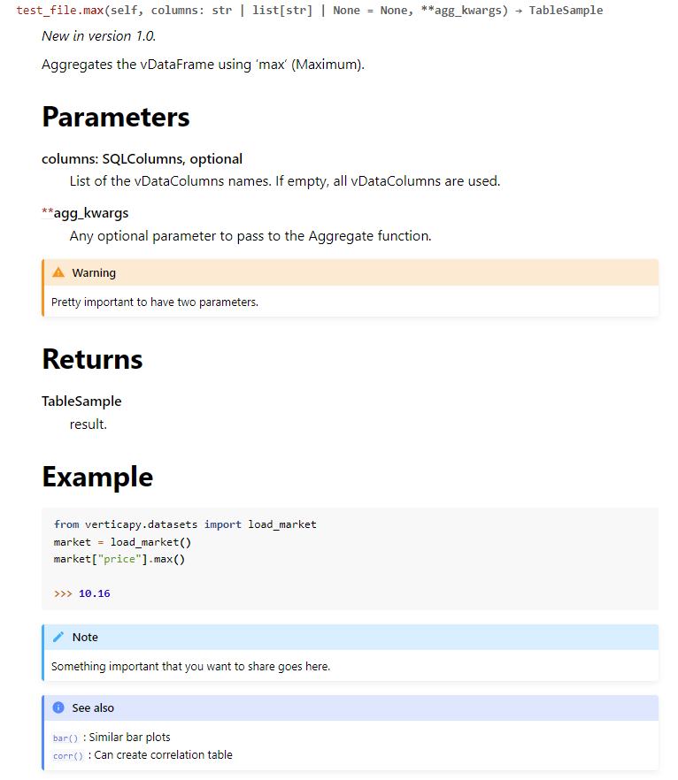
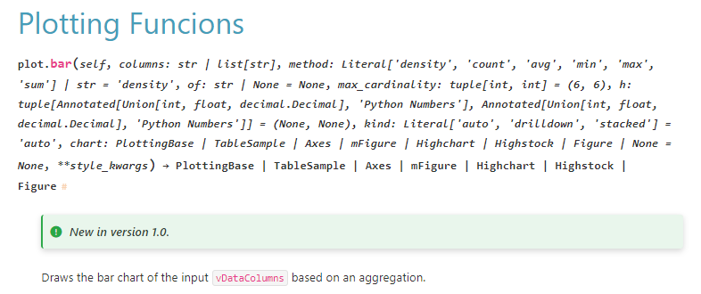
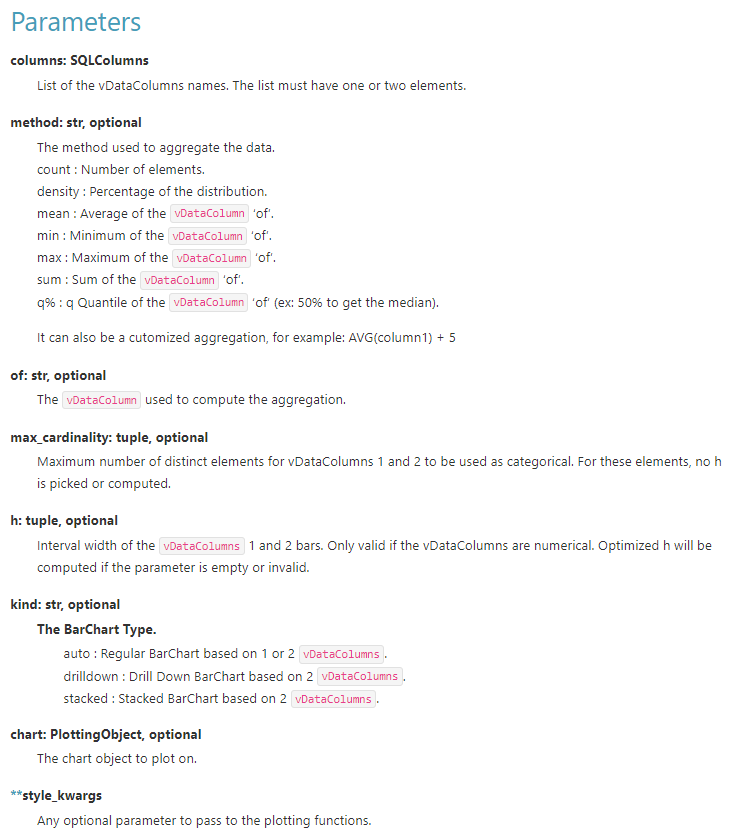
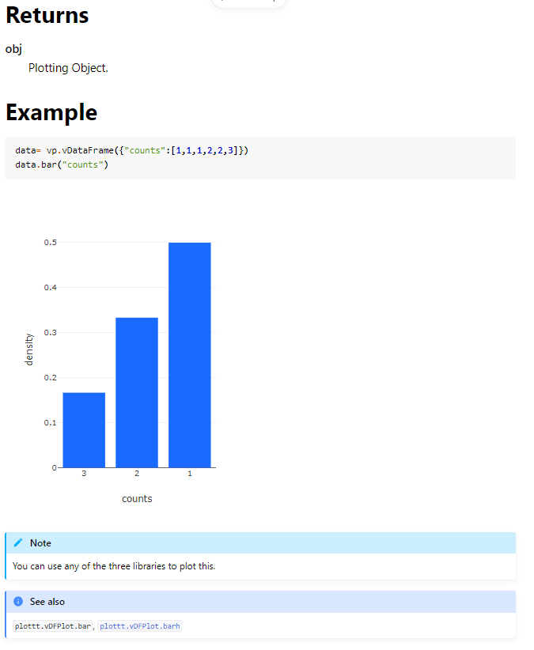
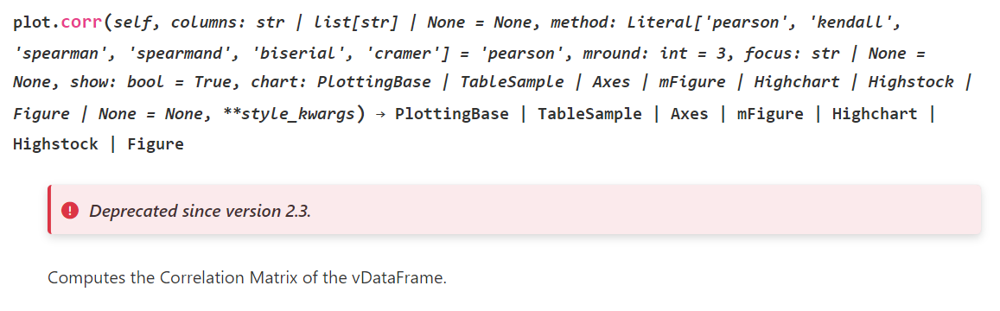
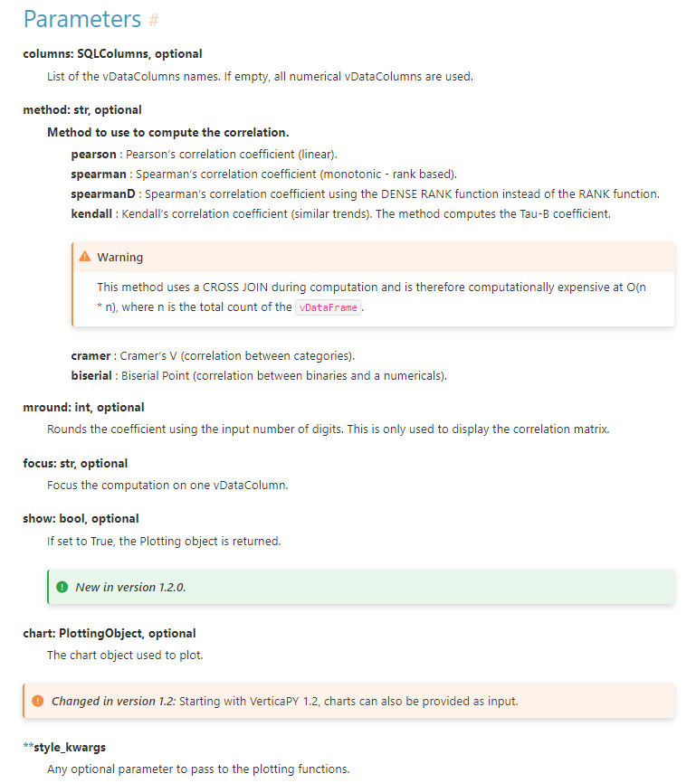
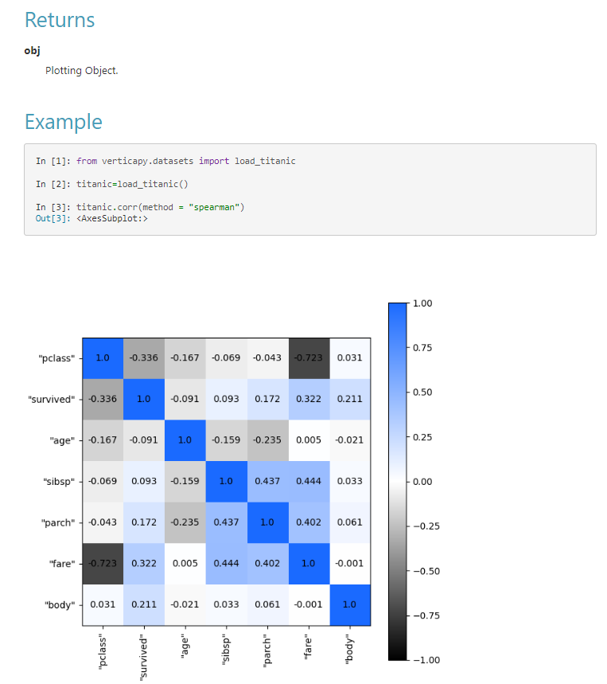
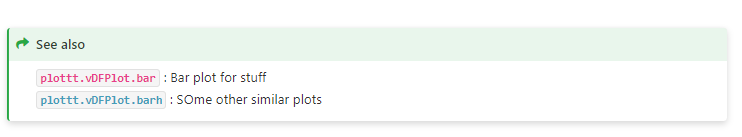
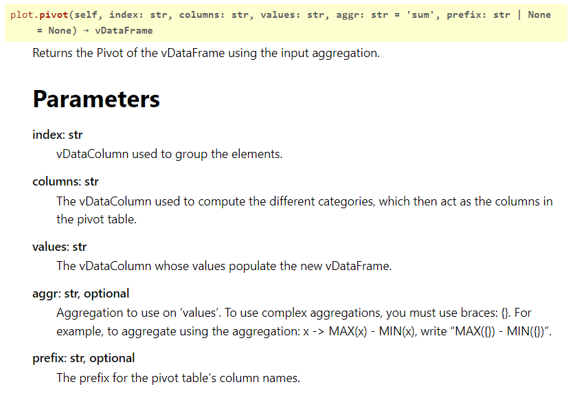
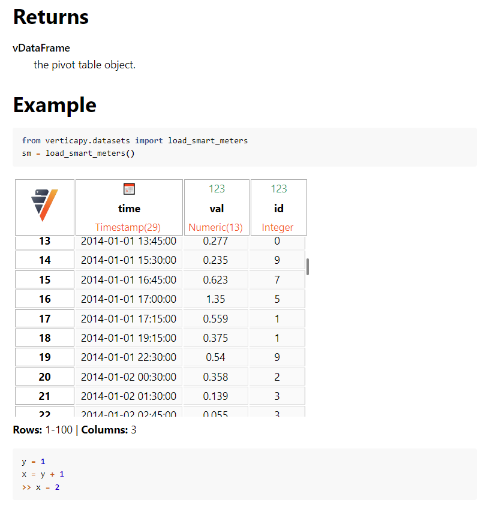

.. _contribution_guidelines.code.auto_doc.example:

========================
Complete Example
========================

.. include:: logo_include.rst

Comprehensive docstring templates and examples for VastOrbit documentation.

____

📋 Docstring Structure
-----------------------

Every VastOrbit function docstring should follow this structure:

1. **Version Information** (optional)
2. **Description** (required)
3. **Parameters** (required)
4. **Returns** (required)
5. **Examples** (required)
6. **Notes/Warnings** (optional)
7. **See Also** (optional)

____

🏷️ Version Information
-----------------------

**New Feature:**

.. code-block:: rst
    
    .. versionadded:: 1.0

**Output:**

.. versionadded:: 1.0

**Deprecated Feature:**

.. code-block:: rst

    .. deprecated:: 2.0

**Output:**

.. deprecated:: 2.0

**Changed Feature:**

.. code-block:: rst

    .. versionchanged:: 1.5.0

**Output:**

.. versionchanged:: 1.5.0

.. note:: Not applicable to functions already in VastOrbit since inception.

.. hint:: For complete list of admonitions: https://sphinx-themes.org/sample-sites/furo/kitchen-sink/admonitions/

____

📝 Description
--------------

**Best Practices:**

- ✅ Write one summary line at the top
- ✅ Add detailed explanation below
- ✅ Use inline code blocks with backticks: ```VastFrame```
- ✅ Reference VastOrbit objects: ``:py:class:`~VastColumn```

**Example:**

.. code-block:: python

    def one_hot_encode(
        self,
        prefix: Optional[str] = None,
        prefix_sep: str = "_",
        drop_first: bool = True,
        use_numbers_as_suffix: bool = False,
    ) -> "VastFrame":
        """     
        Encodes the :py:class:`~VastColumn` with the One-Hot Encoding algorithm.

        One hot encoding will be done on the selected column. The result will be 
        outputted in new columns thus resulting in additional columns added to the 
        table. The first category/dummy will be dropped by default unless stated 
        otherwise by the parameter ``drop_first``.
        """

**Output:**

    Encodes the :py:class:`~VastColumn` with the One-Hot Encoding algorithm.

    One hot encoding will be done on the selected column. The result will be 
    outputted in new columns thus resulting in additional columns added to the 
    table. The first category/dummy will be dropped by default unless stated 
    otherwise by the parameter ``drop_first``.

____

📌 Parameters
-------------

Format: Add parameter type and description. Create heading with ``----------`` underline.

.. code-block:: python

    """
    Parameters
    ----------
    x: int
        x is the input value
    y: str, optional
        Optional string parameter. Default is None.
    """

**Output:**

    Parameters
    ----------
    x: int
        x is the input value
    y: str, optional
        Optional string parameter. Default is None.

____

↩️ Returns
----------

Format: Specify return type and description.

.. code-block:: python

    """
    Returns
    -------
    PlottingObject
        Plotting object with chart.
    """

**Output:**

    Returns
    -------
    PlottingObject
        Plotting object with chart.

____

💡 Examples
-----------

Static Code Block
~~~~~~~~~~~~~~~~~

Display code without execution:

.. code-block:: rst

    .. code-block:: python

        >>> x = [1, 2, 3]
        >>> max(x)
        3

**Output:**

.. code-block:: python

    >>> x = [1, 2, 3]
    >>> max(x)
    3

Executed Code
~~~~~~~~~~~~~

Display and execute code:

.. code-block:: rst

    .. ipython:: python

        x = 2
        y = 3
        x + y

**Output:**

.. ipython:: python

    x = 2
    y = 3
    x + y

____

📊 Figures & Equations
----------------------

Equations
~~~~~~~~~

.. code-block:: rst

    .. math::

        (a + b)^2 = a^2 + 2ab + b^2

**Output:**

.. math::

    (a + b)^2 = a^2 + 2ab + b^2

Matplotlib Plots
~~~~~~~~~~~~~~~~

Use ``@savefig`` pseudo-directive:

.. code-block:: rst

    .. ipython:: python
        :suppress:

        import vastorbit as vo
        @savefig core_VastFrame_plotting_bar_1.png
        vo.VastFrame({"counts":[1,2,1,2]}).bar("counts")

.. important:: 

   Add ``figures/`` directory prefix: ``figures/filename.png``

.. note:: 

   VastOrbit is imported by default - no need to show import unless demonstrating specific usage.

Plotly/Highcharts Plots
~~~~~~~~~~~~~~~~~~~~~~~~

Save as HTML then display:

.. code-block:: rst

    .. ipython:: python
        :suppress:

        import vastorbit as vo
        vo.set_option("plotting_lib", "plotly")
        data = vo.VastFrame({"counts":[1,1,1,2,2,3]})
        fig = data.bar("counts")
        fig.write_html("figures/core_VastFrame_vDFPlot_bar.html")

    .. raw:: html
        :file: SPHINX_DIRECTORY/figures/core_VastFrame_vDFPlot_bar.html

.. important::

   Use ``SPHINX_DIRECTORY/figures/`` prefix when loading HTML files.

VastFrame Table Output
~~~~~~~~~~~~~~~~~~~~~~~

.. code-block:: rst

    .. ipython:: python
        :suppress:

        from vastorbit.datasets import load_smart_meters
        sm = load_smart_meters()
        html_file = open("figures/core_VastFrame_agg_table.html", "w")
        html_file.write(sm._repr_html_())
        html_file.close()

    .. raw:: html
        :file: SPHINX_DIRECTORY/figures/core_VastFrame_agg_table.html

____

📢 Notes & Admonitions
----------------------

.. code-block:: rst
    
    .. note:: This is an informational note

    .. tip:: This is a helpful tip

    .. hint:: This is a hint

    .. important:: This is important information

    .. warning:: This is a warning

    .. danger:: This is a danger warning

**Output:**

.. note:: This is an informational note

.. tip:: This is a helpful tip

.. hint:: This is a hint

.. important:: This is important information

.. warning:: This is a warning

.. danger:: This is a danger warning

____

🔗 See Also
-----------

Reference related functions:

.. code-block:: rst

    .. seealso:: 

        :py:func:`~bar` : Similar bar plots

**Output:**

.. seealso:: 

   :py:func:`~bar` : Similar bar plots

Reference modules:

.. code-block:: rst

    .. seealso:: 

        :py:mod:`~vastorbit.VastFrame`

**Output:**

.. seealso:: 

   :py:mod:`~vastorbit.VastFrame`

____

📚 Complete Examples
--------------------

Example 1: Basic Function (max)
~~~~~~~~~~~~~~~~~~~~~~~~~~~~~~~~

.. code-block:: python

    def max(
        self,
        columns: Optional[SQLColumns] = None,
        **agg_kwargs,
    ) -> TableSample:
        """
        .. versionadded:: 1.0

        Aggregates the VastFrame using 'max' (Maximum).

        Parameters
        ----------
        columns: SQLColumns, optional
            List of the VastColumns names. If empty, all VastColumns
            are used.
        **agg_kwargs
            Any optional parameter to pass to the Aggregate function.

        .. warning:: 
            Pretty important to have two parameters.

        Returns
        -------
        TableSample
            result.

        Examples
        --------

        .. code-block:: python

            from vastorbit.datasets import load_market
            market = load_market()
            market["price"].max()

            >>> 10.16

        .. note:: Something important that you want to share goes here.

        .. seealso:: 
            | :py:func:`~bar` : Similar bar plots
            | :py:func:`~corr` : Can create correlation table

        """
        return None

**Output:**



____

Example 2: Plotting Function (bar)
~~~~~~~~~~~~~~~~~~~~~~~~~~~~~~~~~~~

.. code-block:: python

    def bar(
        self,
        columns: SQLColumns,
        method: PlottingMethod = "density",
        of: Optional[str] = None,
        max_cardinality: tuple[int, int] = (6, 6),
        h: tuple[PythonNumber, PythonNumber] = (None, None),
        kind: Literal["auto", "drilldown", "stacked"] = "auto",
        chart: Optional[PlottingObject] = None,
        **style_kwargs,
    ) -> PlottingObject:
        """
        .. versionadded:: 1.0

        Draws the bar chart of the input :py:class:`~VastColumn` based
        on an aggregation.

        Parameters
        ----------
        columns: SQLColumns
            List of the VastColumns names. The list must
            have one or two elements.
        method: str, optional
            The method used to aggregate the data.
            
            | count   : Number of elements.
            | density : Percentage of the distribution.
            | mean    : Average of the :py:class:`~VastColumn` 'of'.
            | min     : Minimum of the :py:class:`~VastColumn` 'of'.
            | max     : Maximum of the :py:class:`~VastColumn` 'of'.
            | sum     : Sum of the :py:class:`~VastColumn` 'of'.
            | q%      : q Quantile of the :py:class:`~VastColumn` 'of'
                        (ex: 50% to get the median).
            
            It can also be a customized aggregation, for example:
            AVG(column1) + 5
        of: str, optional
            The :py:class:`~VastColumn` used to compute the aggregation.
        max_cardinality: tuple, optional
            Maximum number of distinct elements for VastColumns
            1 and 2 to be used as categorical. For these
            elements, no h is picked or computed.
        h: tuple, optional
            Interval width of the :py:class:`~VastColumn` 1 and 2 bars.
            Only valid if the VastColumns are numerical.
            Optimized h will be computed if the parameter is
            empty or invalid.
        kind: str, optional
            The BarChart Type.
            
            | auto      : Regular BarChart based on 1 or 2
                          :py:class:`~VastColumn`.
            | drilldown : Drill Down BarChart based on 2
                          :py:class:`~VastColumn`.
            | stacked   : Stacked BarChart based on 2
                          :py:class:`~VastColumn`.
        chart: PlottingObject, optional
            The chart object to plot on.
        **style_kwargs
            Any optional parameter to pass to the plotting
            functions.

        Returns
        -------
        PlottingObject
            Plotting Object.

        Examples
        --------

        .. ipython:: python
            :suppress:

            import vastorbit as vo
            vo.set_option("plotting_lib", "plotly")
            data = vo.VastFrame({"counts":[1,1,1,2,2,3]})
            fig = data.bar("counts")
            fig.write_html("figures/core_VastFrame_vDFPlot_bar.html")

        .. code-block:: python
        
            data = vo.VastFrame({"counts":[1,1,1,2,2,3]})
            data.bar("counts")

        .. raw:: html
            :file: SPHINX_DIRECTORY/figures/core_VastFrame_vDFPlot_bar.html

        .. note:: You can use any of the three libraries to plot this.

        .. seealso:: 
            :py:func:`~plottt.vDFPlot.bar`, :py:func:`~plottt.vDFPlot.barh`

        """

**Output:**







____

Example 3: Statistical Function (corr)
~~~~~~~~~~~~~~~~~~~~~~~~~~~~~~~~~~~~~~~

.. code-block:: python

    def corr(
        self,
        columns: Optional[SQLColumns] = None,
        method: Literal[
            "pearson", "kendall", "spearman", "spearmand", "biserial", "cramer"
        ] = "pearson",
        mround: int = 3,
        focus: Optional[str] = None,
        show: bool = True,
        chart: Optional[PlottingObject] = None,
        **style_kwargs,
    ) -> PlottingObject:
        """
        .. deprecated:: 2.3

        Computes the Correlation Matrix of the VastFrame.

        Parameters
        ----------
        columns: SQLColumns, optional
            List of the VastColumns names. If empty, all
            numerical VastColumns are used.
        method: str, optional
            Method to use to compute the correlation.
            
            **pearson**   : 
                Pearson's correlation coefficient
                (linear).

            **spearman**  : 
                Spearman's correlation coefficient
                (monotonic - rank based).

            **spearmanD** : 
                Spearman's correlation coefficient
                using the DENSE RANK function
                instead of the RANK function.

            **kendall**   : 
                Kendall's correlation coefficient
                (similar trends). The method
                computes the Tau-B coefficient.

            .. Warning::
                This method uses a CROSS JOIN during computation and 
                is therefore computationally expensive at O(n * n), 
                where n is the total count of the :py:class:`~VastFrame`.
            
            **cramer**    : 
                Cramer's V
                (correlation between categories).
            **biserial**  : 
                Biserial Point
                (correlation between binaries and numericals).

        mround: int, optional
            Rounds the coefficient using the input number of
            digits. This is only used to display the correlation
            matrix.
        focus: str, optional
            Focus the computation on one VastColumn.
        show: bool, optional
            If set to True, the Plotting object is
            returned.
        chart: PlottingObject, optional
            The chart object used to plot.
        **style_kwargs
            Any optional parameter to pass to the plotting
            functions.

        Returns
        -------
        PlottingObject
            Plotting Object.

        Examples
        --------

        .. ipython:: python
            
            from vastorbit.datasets import load_titanic
            titanic = load_titanic()
            @savefig core_VastFrame_agg_corr.png
            titanic.corr(method = "spearman")

        .. seealso::
            | :py:func:`~plottt.vDFPlot.bar` : Bar plot for stuff
            | :py:func:`~plottt.vDFPlot.barh` : Some other similar plots

        """

**Output:**









____

Example 4: Data Transformation (pivot)
~~~~~~~~~~~~~~~~~~~~~~~~~~~~~~~~~~~~~~~

.. code-block:: python

    def pivot(
        self,
        index: str,
        columns: str,
        values: str,
        aggr: str = "sum",
        prefix: Optional[str] = None,
    ) -> "VastFrame":
        """
        Returns the Pivot of the VastFrame using the input aggregation.

        Parameters
        ----------
        index: str
            VastColumn used to group the elements.
        columns: str
            The VastColumn used to compute the different categories,
            which then act as the columns in the pivot table.
        values: str
            The VastColumn whose values populate the new VastFrame.
        aggr: str, optional
            Aggregation to use on 'values'. To use complex aggregations,
            you must use braces: {}. For example, to aggregate using the
            aggregation: x -> MAX(x) - MIN(x), write "MAX({}) - MIN({})".
        prefix: str, optional
            The prefix for the pivot table's column names.

        Returns
        -------
        VastFrame
            the pivot table object.

        Examples
        --------
        
        .. code-block:: python

            from vastorbit.datasets import load_smart_meters
            sm = load_smart_meters()

        .. ipython:: python
            :suppress:

            from vastorbit.datasets import load_smart_meters
            sm = load_smart_meters()
            html_file = open("figures/core_VastFrame_aggregate_pivot.html", "w")
            html_file.write(sm._repr_html_())
            html_file.close()

        .. raw:: html
            :file: SPHINX_DIRECTORY/figures/core_VastFrame_aggregate_pivot.html

        .. code-block:: python

            y = 1
            x = y + 1
            >>> x = 2

        """
        return None

**Output:**





____

📝 Key Takeaways
----------------

**Remember:**

- ✅ Headers created with ``----------`` underneath
- ✅ Parameters automatically bolded
- ✅ Inline code blocks use backticks: ```code```
- ✅ Admonitions: ``.. note:``, ``.. warning:``, ``.. tip:``
- ✅ Three code display options:
  
  1. Static: ``.. code-block:: python``
  2. Executed: ``.. ipython:: python``
  3. Hidden: ``.. ipython:: python`` with ``:suppress:``

- ✅ Graphs via matplotlib: ``@savefig filename.png``
- ✅ Graphs via plotly/highcharts: Save as HTML + ``.. raw:: html``
- ✅ VastFrame tables: Export HTML + ``.. raw:: html``

.. note:: 

   Display of admonitions, graphics, and text is affected by the selected theme. 
   Examples compiled using "furo" and "pydata_sphinx_theme".

.. tip::

   Copy these examples as templates for your docstrings. Adjust based on your function's complexity.

.. seealso::

   - :ref:`contribution_guidelines.code.auto_doc` - Full documentation guide
   - :ref:`contribution_guidelines.code.auto_doc.render` - Preview locally