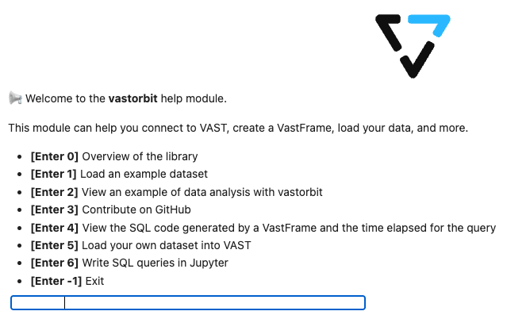

.. _user_guide.introduction.installation:

==============================
Connect to a VAST Database
==============================

Quick guide to connecting VAST Orbit to your VAST database.

____

Requirements
------------

Before connecting, ensure you have:

- **VAST Database** – Any version with Trino interface enabled
- **Python 3.12+** – Latest Python installation
- **VAST Orbit** – Installed via ``pip install vastorbit``

For installation instructions, see :ref:`getting_started`.

____

Connect to Database
-------------------

Use :py:func:`~vastorbit.connection.write.new_connection` to create and save a connection:

.. code-block:: python

    import vastorbit as vo

    vo.new_connection(
        {
            "host": "12.345.67.89",
            "port": "8080",
            "catalog": "vast",
            "schema": "default",
            "user": "admin",
            # "password": "your_password",  # Optional
        },
        name="vast_connection",
    )

.. ipython:: python
    :suppress:

    import vastorbit as vo

The connection is saved and can be reused with :py:func:`~vastorbit.connection.connect.connect`:

.. code-block:: python

    vo.connect("vast_connection")

____

Manage Connections
------------------

**View all saved connections:**

.. code-block:: python

    vo.available_connections()

**Output:**

.. code-block:: python

    ['vast_connection', 'production_db', 'dev_cluster']

**Get function help:**

.. ipython:: python
    :suppress:

    import inspect
    import re

    def help(obj):
        signature = f"Help on function {obj.__name__} in module {obj.__module__}:\n\n{obj.__name__}{inspect.signature(obj)}"
        doc = inspect.getdoc(obj)
        if doc:
            short_doc = re.split(r"\n\s*Examples\s*[-=]*\s*\n", doc)[0]
            print(f"{signature}\n\n{short_doc}")

.. ipython:: python

    help(vo.new_connection)

____

Interactive Setup
-----------------

Launch the interactive setup guide:

.. code-block:: python

    vo.help_start()

____

Connection Parameters
---------------------

**Required parameters:**

- ``host`` – VAST cluster hostname or IP address
- ``port`` – Trino port (default: ``8080``)
- ``catalog`` – Data catalog name (default: ``vast``)
- ``schema`` – Schema name (default: ``default``)
- ``user`` – Username (default: ``admin``)

**Optional parameters:**

- ``password`` – User password (if authentication enabled)
- ``http_scheme`` – ``http`` or ``https`` (default: ``http``)

.. tip::

   For production environments, use environment variables for credentials:

   .. code-block:: python

       import os

       vo.new_connection(
           {
               "host": os.getenv("VAST_HOST"),
               "user": os.getenv("VAST_USER"),
               "password": os.getenv("VAST_PASSWORD"),
           },
           name="production",
       )

.. seealso::

   - :ref:`user_guide.introduction.vdf` – Learn about VastFrame
   - :ref:`api.connect` – Complete connection API reference